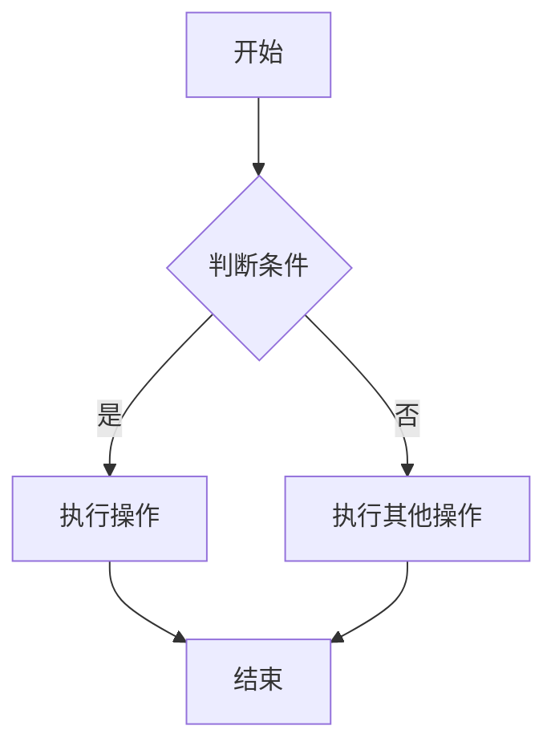

## 👋 前言

欢迎来到我的博客！这是一篇测试文章，用来展示博客的各种功能特性。

## ✨ 功能展示

### 代码高亮

博客支持多种编程语言的代码高亮：

```python
def hello_world():
    print("Hello, World!")
    return True
```

```javascript
const greeting = (name) => {
  console.log(`Hello, ${name}!`);
};
```

### 提示块引用


这是一条提示信息，帮助你更好地理解内容。


### 折叠面板


这里是折叠的内容，可以用来放一些额外的信息或参考资料。


### 链接卡片



### 标签页



<!-- tab 安装 -->

```bash
hugo new site myblog
cd myblog
```

<!-- tab 配置 -->

编辑 `hugo.toml` 文件进行配置。

<!-- tab 运行 -->

```bash
hugo server
```



## 📊 Mermaid 图表

如果需要展示流程图，可以这样写：



## 📝 数学公式

博客支持 LaTeX 数学公式渲染：

行内公式：$E = mc^2$

独立公式：
$$
\int_{0}^{\infty} e^{-x^2} dx = \frac{\sqrt{\pi}}{2}
$$

## 🎯 写在最后

这篇文章只是一个开始，后续我会分享更多学习笔记和技术文章。

如果你有任何问题或建议，欢迎在评论区留言！

> *静待风起，疾风知劲草 🌬️*